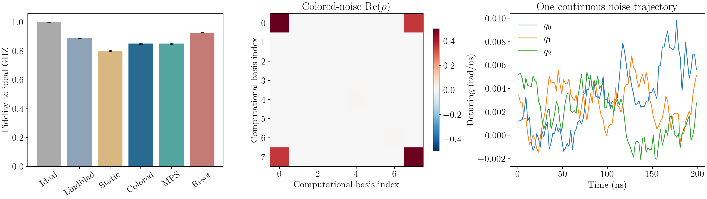

# 有限时长量子门与非马尔可夫噪声：数值模拟报告

日期：2026-09-21。数据来源：[2048 条轨迹验证运行](../results/validated/summary.json)。

本报告记录已实际执行的数值原型及其输出。研究方案见[独立文档](research-plan.md)，数学约定和使用方法见[README](../README.md)。

## 1. 目标与已实现的方法

从指定初态出发，使量子控制与噪声在有限门时长内同时作用，预测终态密度矩阵和观测量，并通过独立数值表示检查实现。

| 方法 | 物理模型 | 数值表示 | 验证用途 |
|---|---|---|---|
| 直接矩阵轨迹 | 经典 Gaussian 有色噪声 | 每个时间格指数化完整系统 Hamiltonian | 三比特基准 |
| MPS 轨迹 | 与矩阵版相同的完整噪声轨迹 | 空间 MPS、局域门、SVD、Strang 分裂 | 表示与时间分裂的交叉验证 |
| HEOM | 热平衡量子谐振子浴 | 系统密度矩阵和辅助密度算符 ADO | 保留量子浴与跨门记忆 |
| 显式环境 | 与 HEOM 相同的离散谐振子浴 | 系统与环境联合密度矩阵，再对浴求偏迹 | 独立核验 HEOM |

另实现 quasi-static、连续 Lindblad、门边界环境重置对照。MPS 是数值表示，环境记忆是模型属性；当前未实现论文中的 MPS-HEOM 层级压缩或 TEMPO。

## 2. 三比特电路与噪声

初态为 $|000\rangle$。第 0 比特是计算基中最左边的一位。控制按时间依次为：

| 控制 | 时间 |
|---|---:|
| $R_y^{(0)}(\pi/2)$ | 20 ns |
| $CX(0,1)$ | 80 ns |
| $CX(1,2)$ | 80 ns |
| 等待 | 20 ns |

理想终态是 $|\mathrm{GHZ}\rangle=(|000\rangle+|111\rangle)/\sqrt2$。CNOT 采用可验证的理想 Hamiltonian，不是器件校准后的 CR 波形。

取 $\hbar=1$，整个过程中

$$H(t)=H_{\mathrm{ctrl}}(t)+\frac12\sum_i\xi_i(t)Z_i.$$

每个比特的 $\xi_i(t)$ 是 K=12 个平稳 OU 过程之和，相关函数和双边谱为

$$C_\xi(t)=\frac{\sigma^2}{K}\sum_k e^{-\gamma_k|t|},\qquad S_\xi(\omega)=\frac{\sigma^2}{K}\sum_k\frac{2\gamma_k}{\gamma_k^2+\omega^2}.$$

参数为 $\sigma=0.004\,\mathrm{rad/ns}$，$\gamma_k$ 在 $[10^{-4},0.1]\,\mathrm{ns}^{-1}$ 上对数分布。谱仅在频带内部近似 $1/|\omega|$，低频和高频已正则化。连续轨迹跨门保存；系统终态是每条轨迹纯态投影的平均。

主运行采用 2048 条轨迹、2 ns 时间格、随机种子 20260921。Lindblad 用有色模型在 100 ns 的 Ramsey 相干度匹配速率 $\gamma_\phi=0.0006057121427863463\,\mathrm{ns}^{-1}$，不是对所有电路做最优拟合。

## 3. 实际结果

Fidelity 定义为 $F=\langle\mathrm{GHZ}|\rho|\mathrm{GHZ}\rangle$。误差为轨迹采样的一个标准误，不是硬件测量误差。

| 模型/算法 | Fidelity | Purity |
|---|---:|---:|
| 无噪声 | 1.000000 | 1.000000 |
| 有色噪声：矩阵 | 0.850970 ± 0.003749 | 0.744451 |
| 同一有色噪声：MPS，2 个子步 | 0.850977 ± 0.003749 | 0.744461 |
| 静态失谐 | 0.799893 ± 0.004746 | 0.677141 |
| 门边界重置有色环境 | 0.926267 ± 0.001987 | 0.862421 |
| 单点校准 Lindblad | 0.888971 | 0.800470 |

有色噪声矩阵版的主要终态分量：

| 量 | 数值 |
|---|---:|
| $P(000)$ | 0.5002606194 |
| $P(100)$ | 0.0040483843 |
| $P(110)$ | 0.0041746047 |
| $P(111)$ | 0.4915163916 |
| $\langle XXX\rangle$ | 0.7101636653 |
| $\rho_{000,111}$ | 0.3550818326 + 0.0003376902 i |

其余计算基概率接近数值零。以上保留位数用于核对文件，不代表相应的统计精度；完整复数矩阵保存在 [final_states.npz](../results/validated/final_states.npz)。

## 4. 量子浴终态

另一个例子从单比特 $|0\rangle$ 出发，执行 $R_y(\pi/2)$、等待、$R_x(\pi/2)$、等待，各 10 ns。Hamiltonian 为

$$H_{\mathrm{tot}}(t)=H_{\mathrm{ctrl}}(t)+\sum_k\omega_k a_k^\dagger a_k+\frac Z2\sum_k g_k(a_k+a_k^\dagger).$$

环境初态为两个独立热态谐振子，初始系统与浴因子化。频率为 0.03、0.12 rad/ns；这些是有限频带 $[0.015,0.24]$ rad/ns 上对称 $1/f$ 谱对数中点求积的两个节点。参数 $\sigma=0.03$ rad/ns、$\beta=60$ ns 是便于数值核验的示例，不是论文或真实器件的温度与噪声拟合。

HEOM 深度 6 的终态：

$$\rho(T)\approx\begin{pmatrix}0.4753604561&0.3189880020+0.0069549082i\\0.3189880020-0.0069549082i&0.5246395439\end{pmatrix}.$$

跨门保留完整 ADO 时得到以上结果；若每个脉冲后只传递系统密度矩阵，相当于重置环境，终态会改变。各脉冲末的完整数据见 [quantum_states.npz](../results/validated/quantum_states.npz)。

## 5. 数值检查

Trace distance 定义为 $D(\rho,\sigma)=\|\rho-\sigma\|_1/2$。

| 检查 | Trace distance |
|---|---:|
| MPS 1 子步与完整矩阵 | 2.7663e-5 |
| MPS 2 子步与完整矩阵 | 6.9150e-6 |
| 同一细轨迹与其粗格平均的矩阵演化 | 3.0223e-6 |
| HEOM 深度 4 与 6 | 1.0355e-7 |
| 显式浴 Fock 截断 5 与 7 | 1.1347e-4 |
| HEOM 深度 6 与显式浴 Fock 7 | 3.0119e-6 |
| 量子浴连续与重置环境 | 0.1161397 |

MPS 两个子步的最大 bond dimension 为 2，记录的 SVD 丢弃权重为零。细粗轨迹对照只检验格内时间顺序误差，不能当作所有连续噪声近似误差的完整上界。

7 项自动测试通过，覆盖无噪声 GHZ、纠缠初态 MPS 与 Strang 收敛、截断报告、OU Ramsey 解析解、Lindblad 衰减率、HEOM 与独立显式浴、HEOM 解析退相干与跨边界连续性。另曾运行四比特小样本矩阵/MPS 对照，终态差异约 9.3e-6；该小样本检查不属于本报告三比特统计结果。

## 6. 能得出的结论与限制

代码可以同时处理有限时长控制与具有时间记忆的环境，并输出终态。矩阵与 MPS 给出一致结果；量子 HEOM 得到独立显式浴的支持。

不同物理模型得到不同 fidelity，不表示更高 fidelity 的模型更接近硬件。需要独立校准与留出实验数据进行模型选择。

两模量子浴仍是粗离散模型，可能有有限模回归。HEOM 与显式浴一致并不意味着收敛到原论文的连续 $1/f$ 浴。经典与量子两个例子的谱、控制和参数不同，也不能直接用它们的结果量化量子环境效应。

当前 MPS 为验证会还原完整终态，因此没有宣称大系统可扩展性。下一步应统一目标谱、器件参数与控制，检查频率离散和层级收敛，再研究真实 CR 门和跨电路预测。

## 7. 文献与文件依据

- Chen et al., [arXiv:2509.07693v2](https://arxiv.org/abs/2509.07693v2)，[本地参考 PDF](../2509.07693v2.pdf)。
- [QuTiP Bosonic HEOM 文档](https://qutip.readthedocs.io/en/v5.1.0/guide/heom/bosonic.html)。
- [OQuPy PT-TEMPO 教程](https://oqupy.readthedocs.io/en/latest/pages/tutorials/pt_tempo.html)，属于可进一步探索、尚未实现的路线。
